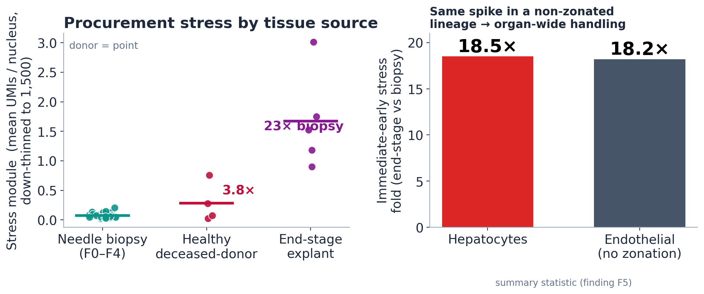
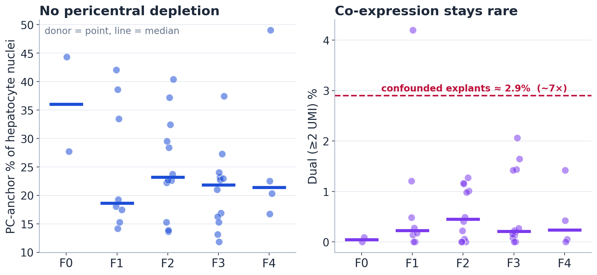
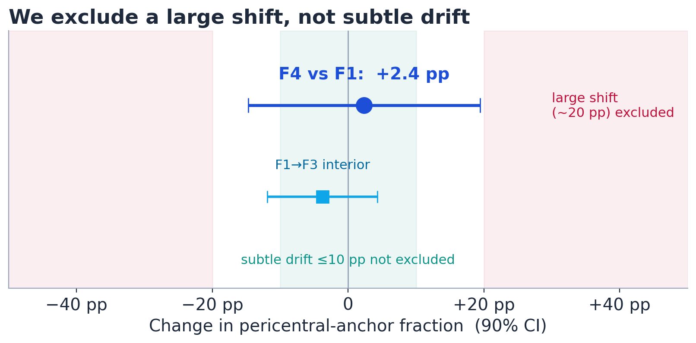
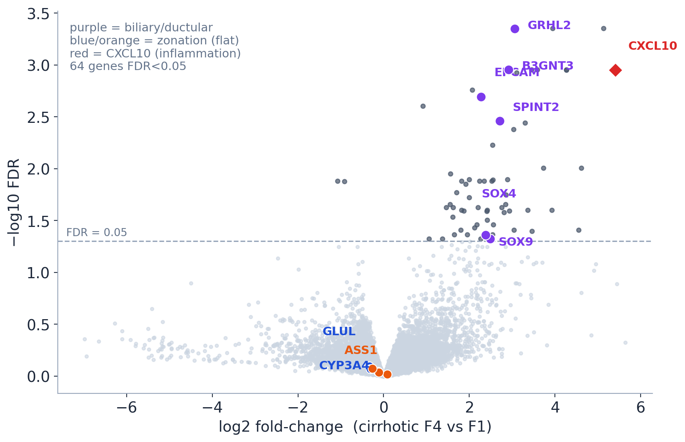

# A matched-source re-test of hepatocyte de-zonation in MASLD

*Relaxed supplementary note — single-nucleus transcriptomic leg only. Re-analysis of Gribben et al., Nature 2024 (GSE202379). Companion to `FINDINGS.md`, `reports/SYNTHESIS.md`, and `CLAIMS_LEDGER.md`, which carry the audited numbers.*

---

## Executive summary

Gribben et al. report that during human chronic liver disease (MASLD) hepatocytes progressively lose their spatial zonation and acquire cholangiocyte-like (biliary) features. We re-examined the single-nucleus RNA-seq evidence for the *progressive de-zonation* part of that claim. The complication we found is structural: **disease stage is collinear with how the tissue was obtained.** Healthy and end-stage samples are deceased-donor organ tissue (a ~1 cm³ cube / explant); the F0–F4 disease spectrum is 16-gauge needle biopsy. So "healthy → MASLD → end-stage" is also "organ cube → needle → explant," and a single pooled correlation cannot tell disease from acquisition. After setting aside the source-confounded endpoints and re-testing on the matched needle-biopsy axis — using raw UMI counts, depth-normalized per nucleus, with the **donor** (~47) as the unit of inference — pericentral/periportal structure is **preserved across fibrosis F1→cirrhotic F4**. A donor-level pseudobulk differential-expression scan finds no zonation-marker loss; its one signal is a small **biliary/ductular-marker burden** at F4, more consistent with cholangiocyte ambient RNA plus rare mixed/doublet nuclei (the ductular reaction) than with broad hepatocyte transdifferentiation. We do not claim to overturn the paper; biliary source attribution is **a lead, not closed.**

---

## 1. Question and scope

The published claim has two parts: hepatocytes progressively *lose zonation*, and they acquire *cholangiocyte-like plasticity*. The paper tests de-zonation with a marker–marker correlation (Welch's t-test) pooled across all 47 donors, and confirms plasticity with tissue imaging.

Our question is narrow: **does the single-nucleus transcriptional evidence for progressive de-zonation survive a matched-source analysis?** Scope: raw snRNA counts only. We do not touch the paper's imaging, immunostaining, protein, organoid, or spatial-architecture evidence — and we agree with the paper that its strong signal is an end-stage phenomenon. We are not claiming to overturn the full paper.

Zonation means hepatocytes run different programs by lobule position: pericentral (PC, near the central vein) cells favor *GLUL, CYP3A4* and drug-metabolizing enzymes; periportal (PP) cells favor *ASS1, PCK1, HAL, ALDOB* (urea cycle, gluconeogenesis). De-zonation could break this in several distinct ways — PC cells deplete, zonal genes turn off, cells co-express both programs, the gradient compresses, or the PP:PC balance shifts. Because each failure mode has a different count signature, we tested them separately rather than leaning on one global score.

---

## 2. Data and the key confound *(the spine)*

The dataset is not one homogeneous disease series. Tissue source is tied to stage:

| Group | Tissue source | Acquisition |
|---|---|---|
| Healthy (n=4) | Deceased-donor organ tissue (one with biliary-stone disease) | ~1 cm³ organ cube |
| Disease F0–F4 | MASLD/NASH/cirrhosis | 16-gauge end-cut needle biopsy |
| End-stage (n=5) | Explanted cirrhotic organs (left/right/caudate lobes) | Whole-organ explant |

Both *ends* of the apparent disease axis are organ tissue; only the F0–F4 middle is needle biopsy (grounded directly in Paper 1''s Methods, `papers/s41586-024-07465-2.pdf`; see `reports/SYNTHESIS.md` §1a). The trajectory "healthy → MASLD → end-stage" is therefore also an **acquisition trajectory** — ischemia, procurement delay, dissociation, organ-cube-vs-needle, and sequencing batch all move together with stage (run almost perfectly predicts tissue source: Cramér''s V ≈ 0.84). This is the load-bearing issue: it motivates excluding the ends and re-testing biopsy-only.

**Figure 1 — Study design and the source confound** *(schematic; see presentation slide 3)*: a three-group panel showing that disease stage runs collinear with acquisition mode, so a pooled comparison reads a procurement discontinuity as biology.

---

## 3. Methods that matter

Only the choices that explain why our result differs.

**3.1 Raw counts, not the shipped matrix.** The distributed matrix is an SCT model output (depth squeezed); we extracted real RNA-assay UMI counts. All molecule inference is on raw counts.

**3.2 Depth-normalized anchor classification.** Each hepatocyte nucleus is down-thinned to a common 1,500-UMI budget (binomial thinning, averaged over draws) so detection reflects biology not depth. A marker is "on" at ≥2 UMI (ambient-robust). Using strict mutually-exclusive anchors — PC = *GLUL/CYP3A4*, PP = *ASS1/PCK1/HAL/ALDOB* — each nucleus is labeled PC, PP, dual, or null. The unit of inference is the **donor**, never the cell. (This is differential-abundance / composition analysis; we call it "anchor classification.")

**3.3 Donor-level pseudobulk DGE.** Sum each donor''s hepatocyte raw UMIs into one count profile; run edgeR (TMM normalization, negative-binomial quasi-likelihood), primary contrast F4-vs-F1 across 38 biopsy donors. Purpose: a genome-wide check for **non-zonation** programs given that zonation structure is treated as settled — not a second de-zonation test.

---

## 4. Results

### R1 — The endpoints carry acquisition stress, so we exclude them
A curated stress module (immediate-early + heat-shock genes), depth-normalized, runs at **0.074** mean UMIs/nucleus in biopsies, **0.282** in healthy organ cubes, and **1.675** in end-stage explants (~22× biopsy). The decisive control is cross-lineage: end-stage-vs-biopsy stress is ~18.5× in hepatocytes and ~18.2× in **endothelial cells**, which carry no zonation program. A signal identical in a non-zonated lineage is whole-organ procurement handling, not hepatocyte biology — and it perturbs exactly the oxygen/Wnt-gradient axis the de-zonation claim rests on. This justifies excluding the source-confounded endpoints from the disease axis.

### R2 — On the matched biopsy axis, zonation is preserved
Across F0–F4 needle biopsies the structure holds by every failure mode:
- **Depletion:** PC-anchor fraction 36/19/23/22/21% (F0–F4) — flat/non-monotone.
- **Co-expression:** the dual fraction looks inflated (~7–10%) only at a 1-UMI threshold; at the ambient-robust ≥2-UMI cut it collapses to **~0.2–0.6%** with no trend — the 1-UMI signal was ambient soup.
- **Turn-off:** null fraction flat.
- **Composition:** PP:PC ratio 0.62/1.16/1.01/1.10/1.18 — flat/non-monotone.

The poles stay dominant; at most a mild non-monotone middle-ward drift. The null is robust across the full sensitivity grid and a marker-set ladder from 2 to 1,637 genes (including Paper 2''s own 40 landmark genes).

### R3 — Robustness and an honest bound
The result is stable across the sensitivity grid (depth budgets 1,000/1,500/3,000; GLUL-only/CYP3A4-only/both; Monte-Carlo SD on donor medians 0.006–0.010). An affirmative equivalence test (TOST, 90% CI, donor-level anchor fractions) puts the F4-vs-F1 PC-anchor change at **+0.024 (90% CI −0.147 to +0.194)**. So we **exclude a large shift on the order of 20 percentage points** (the well-powered F1→F3 interior tightens to ~±0.12); we do **not** exclude a subtle drift of ≤10 points (donor SD is large at F4 n=4). Large re-zonation is ruled out; subtle drift is not.

### R4 — The only DGE signal is a biliary burden, likely compositional
Genome-wide, of ~21,000 genes only **64** reach FDR < 0.05 at F4-vs-F1, and they are a biliary/ductular set — *EPCAM, GRHL2, SPINT2, SOX4, SOX9, B3GNT3* — plus *CXCL10*. Zonation genes are flat at the expression level (**GLUL FDR 0.80 — not significant**; all detox genes FDR > 0.79), an independent count-based check agreeing with the anchor classification. So the discovery scan finds **a biliary-marker burden inside hepatocyte-labeled pseudobulk, not zonation loss.**

Source attribution (a side lead): the headline genes are 5–78× more abundant in cholangiocytes than hepatocytes; the cholangiocyte fraction rises to ~8% at F4 (the ductular reaction); only ~0.4% of hepatocyte nuclei robustly co-express ≥2 biliary markers; ambient correction (decontX) cuts hits 64→34 and drops *SOX4/SOX9* below significance. But *EPCAM/B3GNT3/SPINT2* survive (decontX is a consistency check, not a verdict), and *CXCL10* is separate — its hepatocyte expression does not track the cholangiocyte fraction (corr −0.09), so it is a candidate real inflammatory signal, not ambient. Careful conclusion: the burden is **real as a signal in hepatocyte-labeled pseudobulk, source not resolved**, and the weight of evidence favors **ambient RNA + rare mixed/doublet nuclei** over broad transdifferentiation.

---

## 5. Interpretation

1. **The full trajectory is source-confounded** — do not read healthy → end-stage as a clean continuation of the disease axis. The endpoints are organ tissue carrying organ-wide procurement stress.
2. **In matched biopsies, transcriptional zonation is preserved** — every failure mode (depletion, co-expression, turn-off, composition shift) is flat across F1→cirrhotic F4, and a large coordinated shift is affirmatively excluded.
3. **The remaining F4 signal is biliary/ductular but source-uncertain** — most consistent with cholangiocyte ambient RNA plus rare mixed/doublet nuclei, with *CXCL10* a possible real hepatocyte inflammatory exception. This source-attribution leg is a promising lead, not a closed finding.

---

## 6. Limitations and next steps

Stated plainly, not apologetically. This is a hackathon-scale re-analysis: no wet-lab, no imaging or spatial re-analysis, single cohort. The F4 biopsy stratum is thin (n=4), so subtle effects there are underpowered. Gene-level DGE can miss a *weak coordinated* program in which many genes each shift modestly without any one crossing FDR — so "nothing else moves" carries a gene-level-only caveat. decontX is a sensitivity check using the paper''s own labels (mild circularity), not proof of ambient origin. And anchor markers simplify what is really a continuous gradient; snRNA measures per-cell transcriptional balance, not lobule geometry — we do not claim spatial/architectural preservation.

Next steps: gene-set/pathway tests (CAMERA + ROAST over standard hepatocyte programs) to close the weak-coordinated-program gap; leave-one-F4-donor-out DGE on the biliary hits; a quantitative contamination model asking whether the ambient/doublet burden numerically explains the counts; spatial validation; and an independent MASLD biopsy cohort.

---

## Appendix / backup

- **Why we abandoned the relative ruler.** An early z-scored "zonation coordinate" produced an apparent collapse. It was abandoned for two reasons: (a) it pools across the source confound, so a between-group acquisition discontinuity reads as within-group de-zonation (a Simpson''s-paradox reversal — each healthy donor is individually zonated, anti-corr ≈ −0.21, yet pooling flips the sign to ≈ +0.01); and (b) it is intrinsically depth-sensitive and mechanism-blind — turn-off, co-expression, and noise all shrink its spread alike. The count anchor classification separates the mechanisms; the ruler cannot. (`findings/relative_ruler_postmortem/`.)
- **End-stage is not one program.** Across the five explants the PC-anchor fraction ranges 3%→50% and PP:PC 0.13→20 (CL104 retains pericentral; CL16 collapses to periportal; CL18 floods into co-expression). Pooling five discordant, separately-procured organs into one correlation manufactures a uniform "collapse." (`reports/SYNTHESIS.md` §1f.)
- **Provenance.** Stress and per-donor maps: `load_bearing.py`; cross-lineage stress: `supplementary_checks.py`; marker-set invariance: `all_sets_census.py`; genome-wide DGE: `dge_genomewide.py` / Plan A `findings/dge_plan_a/`; equivalence bound: `findings/equivalence_bound/`. Full numeric record: `FINDINGS.md` and `CLAIMS_LEDGER.md`.
